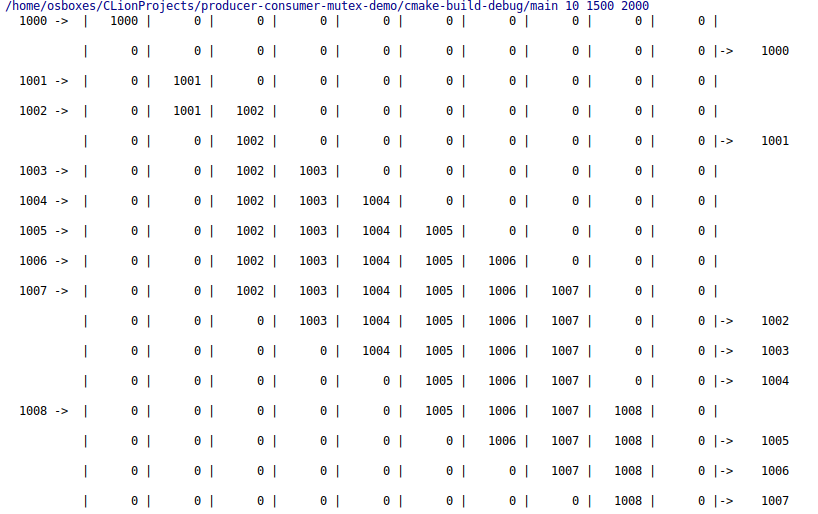
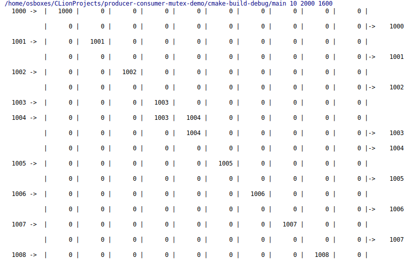

It is a simple program written in C to demonstrate how to use mutex synchronisation in unix systems.
It consists of **Producer** and **Consumer** processes.

Producer tries to put new value into cyclic array if there is an empty space inside.
Consumer tries to get value from array if there is one and leave empty space.

Compile:

    gcc -pthread main.c -o main

Run:

    ./main 10 400 600
    
Arguments:

    1. Buffer Size
    2. Producer Max Sleep [ms]
    3. Consumer Max Sleep [ms]
    
Examples:

    
    
[Read more about mutex mechanisms in unix systems.](http://www.thegeekstuff.com/2012/05/c-mutex-examples/)